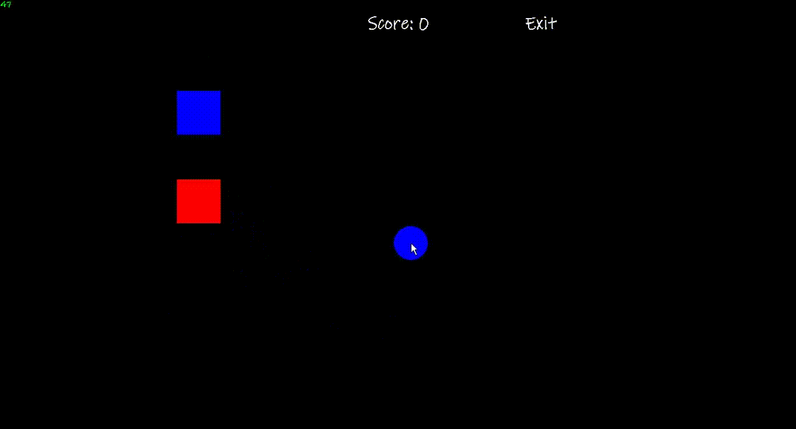
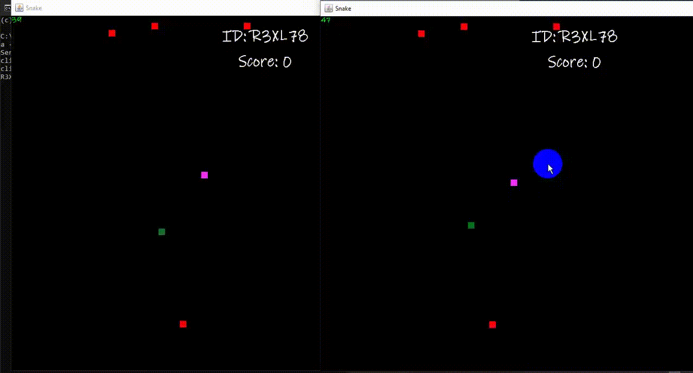
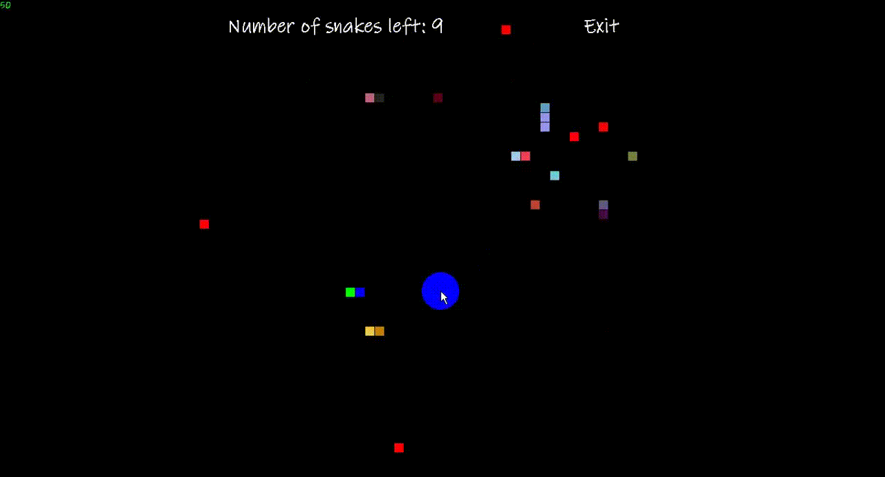

# SnakeGame-Multiplayer
This project is part of the Java programming module at school.
It is a snake hunting game with three modes: single player,
computer and multiplayer.

Use socket for multiplayer feature and use A* algorithm for machine play feature.

* Single player

* Multiplayer

* Play with computer
